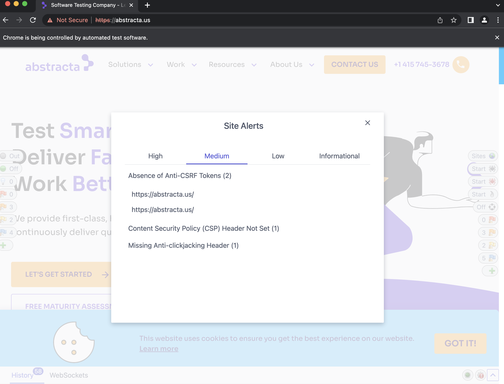
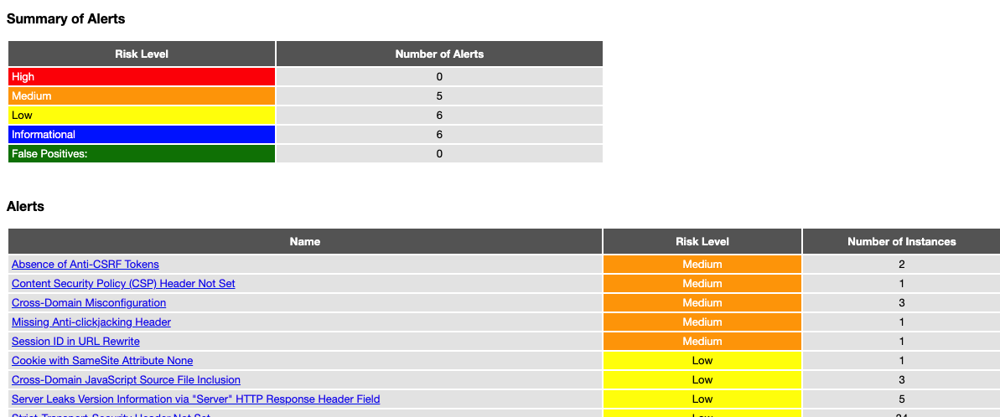

# Selenium 4 con OWASP ZAP

Este es un proyecto que integra Selenium 4 con OWASP ZAP para realizar pruebas de seguridad en aplicaciones web.

## Requisitos previos

Para utilizar este proyecto, es necesario tener instalado lo siguiente:

* Java 11 o superior
* OWASP ZAP 2.10.0 o superior

## Instalación

1. Clona el repositorio.

```
git clone git@gitlab.abstracta.us:Automation/poc-selenium-zap.git
```

2. Configura la propiedad ZAP_API_KEY, ZAP_PROXY_ADDRESS, ZAP_PROXY_PORT en el archivo config.properties con el valor de tu API key de OWASP ZAP.
> `info` Por defecto address sera localhost y el puerto sera 8080. Para obtener el API KEY: abrir la GUI Tools > Options > API y copiar la cadena que se encuentra en el input API Key.
4. Ejecuta el siguiente comando para descargar las dependencias del proyecto:
```
mvn clean install
```

## Uso
Para ejecutar el proyecto y realizar pruebas en una aplicación web, sigue estos pasos:

1. Inicia OWASP ZAP GUI: Puede descargar desde [aqui](https://www.zaproxy.org/download/). También puede descargarlo desde un gestor de paquetes como APT, Chocolatey o Homebrew y levantar el proxy con el siguiente comando:
```
zap.sh -daemon -port 8090
```
2. Ejecuta el siguiente comando para ejecutar el test de Selenium:

```
mvn test
```

3. Verifica que el test haya pasado correctamente.
4. Podra observar que el sitio bajo prueba quedara seteado con los controles de ZAP GUI y desde ahi se pueden ver las vulneabilidades.
   

5. Abre el archivo abstracta-web-security-report.html en un navegador web para ver el reporte generado por OWASP ZAP.
   
## SOBRE OWASP ZAP
OWASP ZAP (Zed Attack Proxy) es una herramienta de prueba de seguridad de aplicaciones web de código abierto. Es utilizado para detectar vulnerabilidades en aplicaciones web y proporcionar una evaluación de seguridad completa.

Entre las características de OWASP ZAP, se incluyen:

* Escaneo de vulnerabilidades automatizado: OWASP ZAP puede realizar pruebas de vulnerabilidades automatizadas para detectar problemas como inyección de SQL, XSS, vulnerabilidades de sesión, vulnerabilidades de autenticación, etc.

* Soporte para varios protocolos: OWASP ZAP admite HTTP, HTTPS y TCP.

* Interceptor de proxy: OWASP ZAP actúa como un proxy entre el navegador y la aplicación web, lo que permite interceptar y modificar solicitudes y respuestas.

* Modo de exploración manual: OWASP ZAP también permite explorar manualmente las aplicaciones web, lo que es útil para probar funcionalidades específicas y personalizadas.

* Informes detallados: OWASP ZAP proporciona informes detallados sobre las vulnerabilidades detectadas, incluyendo información sobre la gravedad de la vulnerabilidad y sugerencias sobre cómo corregirla.

* Integración con otros sistemas: OWASP ZAP puede integrarse con otros sistemas de prueba de seguridad y automatización de pruebas, como Jenkins, Selenium, etc.

* Soporte multiplataforma: OWASP ZAP es compatible con Windows, Linux y Mac OS X.

* Personalización y extensibilidad: OWASP ZAP es altamente personalizable y extensible, lo que permite a los usuarios agregar sus propios scripts de prueba y ajustar la herramienta para satisfacer sus necesidades específicas.

## Integración con Selenium

La integración de OWASP ZAP y Selenium se puede lograr mediante la configuración de un proxy en Selenium para que todas las solicitudes HTTP sean enviadas a través de ZAP. Esto permite que ZAP intercepte todas las solicitudes y respuestas que se realizan a la aplicación web y realice un análisis de seguridad en tiempo real.

A continuación, se presentan los pasos para integrar OWASP ZAP con pruebas de Selenium:

1. Descargue e instale OWASP ZAP en su máquina.
2. Inicie OWASP ZAP y configure el puerto y la dirección IP para que Selenium pueda conectarse.
3. Configure Selenium para usar el proxy de OWASP ZAP. En un proyecto Java y Selenium, puede hacerlo de la siguiente manera:
```
@BeforeMethod
public void setup(){
    String proxyServerUrl = ZAP_PROXY_ADDRESS + ":" + ZAP_PROXY_PORT;
    Proxy proxy = new Proxy();
    proxy.setHttpProxy(proxyServerUrl);
    proxy.setSslProxy(proxyServerUrl);

    ChromeOptions co = new ChromeOptions();
    co.setAcceptInsecureCerts(true);
    co.setProxy(proxy);
    WebDriverManager.chromedriver().setup();
    driver = new ChromeDriver(co);

    api = new ClientApi(ZAP_PROXY_ADDRESS, ZAP_PROXY_PORT, ZAP_API_KEY);

}
```
4. Puede determinar como generar el reporte de la siguiente manera:

```
@AfterMethod
public void tearDown(){
    if (api != null) {
        String title = "POC ZAP Selenium - Abstracta";
        String template = "traditional-html";
        String description = "Este es un reporte de pruebas de ZAP";
        String reportfilename = "abstracta-web-security-report.html";
        String targetFolder = System.getProperty("user.dir");
        try {
            ApiResponse res = api.reports.generate(title, template, null, description, null, null, null,null, null,  reportfilename,null, targetFolder,null);
            System.out.println("Reporte de ZAP generado aqui: " + res.toString());
        } catch (ClientApiException ex) {
            ex.printStackTrace();
        }

    }
}
```
5. Desarrolle las pruebas de Selenium normalmente. Cada solicitud y respuesta se interceptará automáticamente por OWASP ZAP y se analizará en tiempo real.
6. Una vez finalizada la prueba, puede ver los resultados del análisis de seguridad en OWASP ZAP. La herramienta proporciona informes detallados sobre las vulnerabilidades detectadas, clasificándolas por su gravedad y proporcionando información sobre cómo corregirlas.